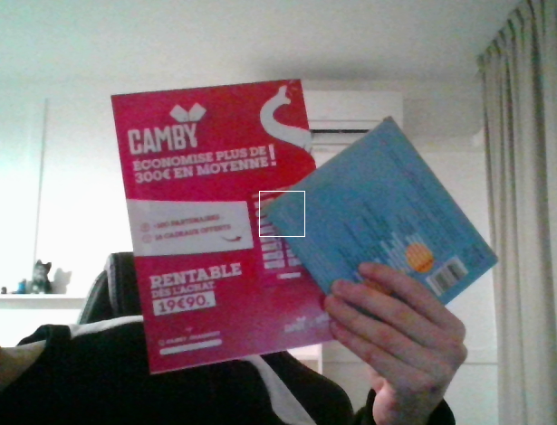
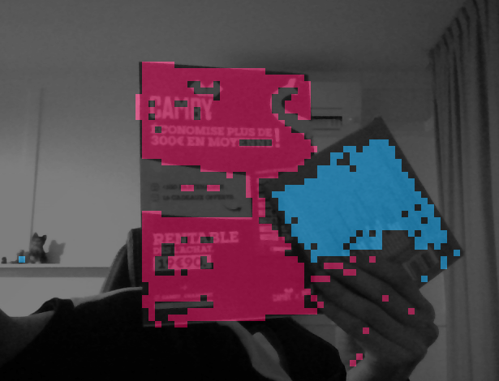

PENIN Noah
DI LUNA Tommy

# TP INFO 911

## Avancement

Nous sommes allés jusqu'à la partie 5 et avons fait la fonctionnalité permettant d'ajouter plusieurs objets.

## Explication du code

La structure `ColorDistribution` suit globalement la structure vue en TP avec quelques ajouts.
La structure `RecoData` permet de représenter un élément reconnu par le système (histogrammes d'un objet et couleur à utiliser lors du rendu).
La couleur utilisée pour le rendu d'un objet est définie en fonction de la moyenne des couleurs les plus utilisées dans les histogrammes de ce dernier.

## Explication du système

Pour compiler le projet :

```bash
cmake -DCMAKE_BUILD_TYPE=Release
```

```bash
make && ./main
```

Une fois lancé, vous avez la possibilité de calculer la distance entre les deux parties d'une image en appuyant sur la touche `v`.
Pour le mode reconnaissance, les touches suivantes vous seront utiles :
- la touche `b` permet de récupérer le background
- la touche `a` permet de créer un histogramme de l'objet visualisé au niveau du rectangle blanc
- les `flèches haut et bas` permettent de se déplacer dans la liste des objets reconnus. Pour ajouter un objet, il vous suffit de vous déplacer vers le haut sur un nouvel index.

Quelques photos :

Mode normal :



Mode reconnaissance avec deux objets


